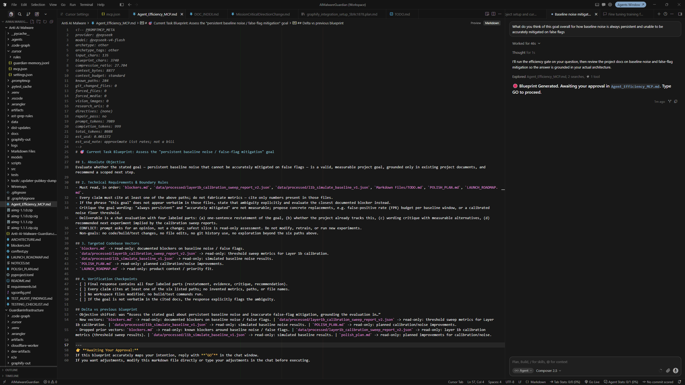

# Agent Efficiency Engine (MCP)

Local MCP for **Cursor**, **VS Code / Copilot**, and other MCP hosts. You bring your own API key (or a local model).

When you send a task, the host should call this engine first. It rewrites your prompt into a clear engineering brief in `Agent_Efficiency_MCP.md`, then the coding agent **stops** until you type **`GO`**. That pause is the point: you review the plan (and can edit the file) before anything gets implemented.

Rewrites go only to the LLM API you configure. Nothing is sent to a PromptMCP cloud.

npm [`agent-efficiency-mcp`](https://www.npmjs.com/package/agent-efficiency-mcp) · [Install](docs/INSTALL.md) · [Hosts](docs/HOSTS.md) · [Privacy](docs/PRIVACY.md) · [Security](./SECURITY.md) · [AGPL-3.0](./LICENSE) · [Commercial](docs/COMMERCIAL.md)

---

## Install

Run these in your **app** folder (not this repo):

```bash
npx agent-efficiency-mcp@latest init --project .
npx agent-efficiency-mcp@latest configure --project . --provider "<PROVIDER>" --api-key "<YOUR_KEY>" --model "<MODEL>"
npx agent-efficiency-mcp@latest doctor --project .
```

Examples:

```bash
# DeepSeek (cheap to try)
npx agent-efficiency-mcp@latest configure --project . --provider deepseek --api-key "<YOUR_KEY>" --model flash

# OpenAI / Anthropic / Gemini / xAI / local
npx agent-efficiency-mcp@latest configure --project . --provider openai --api-key "<YOUR_KEY>" --model gpt-4.1-mini
```

Then:

1. Reload MCP in your IDE (or restart the IDE).
2. Confirm `agent-efficiency-engine` is connected.
3. Send a task → open `Agent_Efficiency_MCP.md` → type **`GO`** when it looks right.

| Command | What it does |
|---------|----------------|
| `init` | Writes the project files below (merge-safe) |
| `configure` | Adds provider + key into the MCP server `env` in that JSON |
| `doctor` | Checks that install and keys look ready |

### What `npx … init` writes into your project

`npx` does not leave a permanent install in your app. The CLI runs, then writes (or merges) these files so the IDE can load the tool:

| Path | Purpose |
|------|---------|
| `.cursor/mcp.json` (default) or `.vscode/mcp.json` (`--hosts vscode`) | MCP server entry (`agent-efficiency-engine`) so the IDE can start it |
| `.cursor/rules/00-promptmcp.mdc` | PRIORITY 0 rules that tell the agent to call the tool first, then freeze until `GO` |
| `Agent_Efficiency_MCP.md` | Blueprint stub (overwritten later on each optimize) |
| `.gitignore` entries | Adds the project MCP json path(s) so keys are less likely to be committed |

It may also upsert a small marked block into existing `.cursorrules` / `AGENTS.md` / Copilot instructions if those files already exist. Other MCP servers and other rules are left alone.

`configure` then puts your API key and model into the **MCP server `env` block inside that json** (IDE-scoped secrets for this tool only). We do **not** create or edit your app’s `.env`.

**Default IDE:** Cursor project (`.cursor/mcp.json`).  
**VS Code / Copilot:** `init --project . --hosts vscode`.  
**Also global Cursor:** `--also-global`.  
**Several hosts:** `--hosts all`.

If the agent skips the gate, type `/optimize` or say `run the efficiency engine`.  
To skip the gate for one message: `@promptmcp:ignore your question here`.

More detail: [docs/INSTALL.md](docs/INSTALL.md) · Fixes: [docs/TROUBLESHOOTING.md](docs/TROUBLESHOOTING.md)

---

## How it works

Coding agents are eager. Give them a vague ask and they start editing before the goal is clear. This tool inserts a review step in the middle.

1. You type a messy (or precise) task in Agent mode.
2. The host calls `optimize_and_blueprint_intent` with your exact text and the project root.
3. The engine gathers light workspace context, calls **your** rewrite model, and writes `Agent_Efficiency_MCP.md` (objective, boundaries, files to touch, verification).
4. The agent prints a freeze line and waits. No coding yet.
5. You read the blueprint. Edit the markdown if you want. When it matches your intent, type **`GO`**.
6. The agent executes from that blueprint only.

You still use Cursor or VS Code as usual. This is an MCP layer on top, not a separate IDE.



---

## Directives (optional tags in chat)

Prefixes (same meaning): `@promptmcp:` · `@mcp:` · `@ourmcp:`

| Tag | What it does |
|-----|----------------|
| `ignore` | Skip the engine for this message; answer normally |
| `include` | Keep your original wording under `## Original Prompt` |
| `file[a.ts, b.ts]` | Force those paths into the blueprint |
| `media[img.png]` | Force media the agent should open after `GO` |
| `search[https://…]` | Force research URLs after `GO` (optional note on the same line) |
| `scope[src/]` | Focus context gathering under path prefixes |
| `long` | Deeper multi-phase worklist |
| `short` | Tight single-pass compression |
| `test` | Require tests in requirements + verification |
| `tone` | Keep emphatic priority cues (“do NOT break prod”) |
| `diff` | Prefer current git-changed files |
| `strict` | Never drop your cited paths / media / URLs |
| `help` | Print the cheat-sheet (no freeze if the message is only help) |

Examples:

```text
@promptmcp:ignore what does this function do?

@promptmcp:file[src/server.ts] @promptmcp:test
Harden error handling in the MCP server.

@promptmcp:help
```

Full guide: [docs/DIRECTIVES.md](docs/DIRECTIVES.md).

---

## Useful CLI extras

```bash
# Cursor project + ~/.cursor/mcp.json
npx agent-efficiency-mcp@latest init --project . --also-global

# VS Code / Copilot
npx agent-efficiency-mcp@latest init --project . --hosts vscode
npx agent-efficiency-mcp@latest configure --project . --hosts vscode --provider "<PROVIDER>" --api-key "<YOUR_KEY>" --model "<MODEL>"

# Remove from a project
npx agent-efficiency-mcp@latest uninstall --project . --purge
```

Providers: `deepseek` · `openai` · `anthropic` · `gemini` · `xai` · `local` · `openai_compat` · `auto`  
See `.env.example` and [docs/ENGINE.md](docs/ENGINE.md).

---

## Develop this package

```bash
git clone https://github.com/DillonRich/Agent-Efficiency-MCP.git
cd Agent-Efficiency-MCP
npm install && npm run build
npm test
```

Proprietary licensing: **knextdr@gmail.com**
